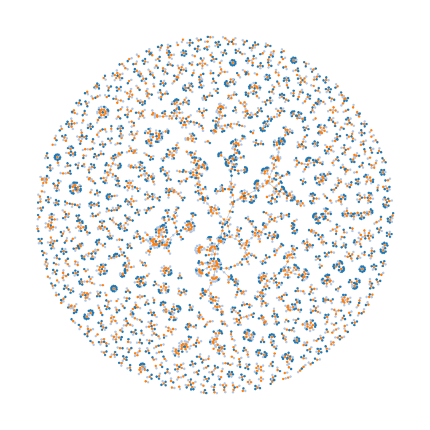

visvssrelationships
===================

Plotting the relationships between VSS 2016 abstracts

##Introduction
These notebooks create a force directed graph of the relationships between VSS 2016 abstract co-authors. It takes a Python dictionary that contains author and title information for the accepted abstracts (```visvssrelationships_data_2016.json```) and creates a dynamic plot using NetworkX and D3.js.  The force directed graph utilizes a physical simulation of charged particles and links to bring co-authored articles closer.



##Prerequisites
You can run the graph generation in Jupyter.

  * jupyter
  * beautifulsoup4
  * tqdm
  * aiohttp
  * networkx
  * requests

D3.js is dynamically loaded for the presentation page.

##Installation & Usage
Running the Jupyter notebooks will generate a "force.json" file in the html subdirectory that has all of the necessary node/link information necessary for D3.js.  Load the index.html file in the html directory to see the dynamic simulation.  Note that since the index.html requires loading a JSON file, you may need to host this on a webserver. To see a live demo, please go to:
* http://steven.cholewiak.com/code/visvssrelationships_2016/

##Related Resources
* [Force-Directed Graph Example](http://bl.ocks.org/mbostock/4062045)
* [D3.js Force Layout Documentation](https://github.com/mbostock/d3/wiki/Force-Layout)
